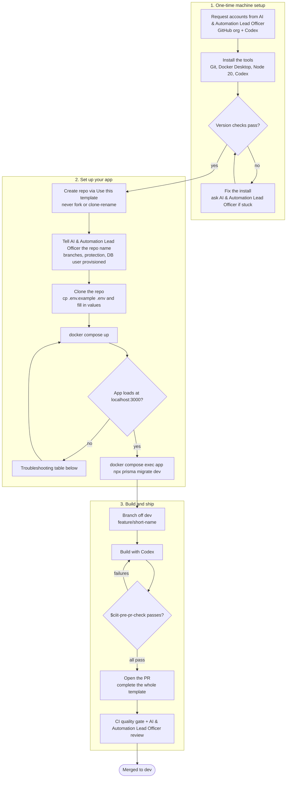

# Environment Setup Guide

Step-by-step setup for builders in the CIIT vibecoding program. You only do the one-time machine setup once; after that, starting work on any app takes a couple of minutes.

If you get stuck at any step, contact the **AI & Automation Lead Officer**. Do not improvise around a broken setup.

## Setup At A Glance



## 1. What You Need

### Accounts

| Account | Why | How to get it |
|---|---|---|
| GitHub account with access to the CIIT organization | Your app repo lives there | Request from AI & Automation Lead Officer |
| ChatGPT/Codex access | Your AI pair-builder | Request from AI & Automation Lead Officer |

### Software

Install these in order:

1. **Git**: <https://git-scm.com/downloads>. On Windows, accept the installer defaults. This also gives you Git Bash, which some project scripts use.
2. **Docker Desktop**: <https://www.docker.com/products/docker-desktop/>. On Windows it may ask to enable WSL 2. Say yes and follow the prompts. Start Docker Desktop once after installing and leave it running while you work.
3. **Node.js 20 LTS**: <https://nodejs.org/>. Pick the 20.x LTS installer.
4. **Codex**: use the ChatGPT desktop app with Codex, or the Codex CLI if the AI & Automation Lead Officer has asked you to use the terminal workflow.
5. **Visual Studio Code** (optional but recommended): <https://code.visualstudio.com/> for browsing files and reviewing changes.

### Check Your Installs

Open a terminal such as PowerShell on Windows and run each line. Every command should print a version, not an error:

```bash
git --version
docker --version
node --version    # should start with v20
npm --version
codex --version   # only required if you use the Codex CLI
```

If `docker --version` works but Docker commands later fail with "cannot connect", Docker Desktop is not running. Start it from the Start menu.

## 2. Create Your App Repository

1. Open the `ciit-vibecode-codex-template` repository on GitHub.
2. Click **Use this template** then **Create a new repository**.
3. Never fork the template and never clone-and-rename it. Repos created via the template button are how IT tracks program apps.
4. Name it after your app, keep it private, and create it inside the CIIT organization.
5. Tell the AI & Automation Lead Officer the repo name so branch protection, the `dev` and `staging` branches, and your database credentials can be provisioned.

## 3. Clone And Configure

Clone your new repo. Replace the URL with your repo's URL:

```bash
git clone https://github.com/YOUR-ORG/your-app.git
cd your-app
```

Create your local environment file from the example:

```bash
cp .env.example .env
```

Open `.env` in an editor and fill in every value:

- `POSTGRES_USER`, `POSTGRES_PASSWORD`, `POSTGRES_DB`: credentials for your local database container. These are local-only, so pick app-specific values.
- `DATABASE_URL`: must match the three values above, with host `db`, which is the database container name.

  ```text
  postgresql://app_user:YOUR_PASSWORD@db:5432/app_db
  ```

- `SESSION_SECRET`: a long random string. Generate one with:

  ```bash
  node -e "console.log(require('crypto').randomBytes(48).toString('base64'))"
  ```

Two rules from [guardrails.md](guardrails.md) apply here: never commit `.env`, and never add `NEXT_PUBLIC_` variables without AI & Automation Lead Officer approval.

## 4. Start The Local Environment

From the repo root, with Docker Desktop running:

```bash
docker compose up
```

The first start downloads images and installs packages, so expect several minutes. You are ready when the log shows Next.js is ready. Then:

- App: <http://localhost:3000>
- PostgreSQL: `localhost:5432`; from inside the app container the host is `db`

Create the database tables the first time, and after any schema change:

```bash
docker compose exec app npx prisma migrate dev --name init
```

Useful commands:

| Command | What it does |
|---|---|
| `docker compose up` | Start app and database |
| `docker compose up -d` | Start in the background |
| `docker compose down` | Stop everything while keeping local data |
| `docker compose logs -f app` | Watch app logs |
| `docker compose exec app <cmd>` | Run a command inside the app container |

## 5. Start Building With Codex

1. Open this repo in Codex through the ChatGPT desktop app, or run `codex` from the repo root if you use the CLI.
2. `AGENTS.md` and `docs/` teach Codex the project rules. `.codex/config.toml` sets project defaults. `.agents/skills/` provides developer workflows such as `$ciit-run-dev`, `$ciit-test`, `$ciit-new-feature`, `$ciit-guardrail-review`, and `$ciit-pre-pr-check`, plus vibe-coder planning helpers such as `$ciit-start-app-idea`, `$ciit-write-user-story`, `$ciit-add-form`, `$ciit-add-table`, `$ciit-check-privacy`, and `$ciit-explain-change`.
3. Before your first change, read [workflow.md](workflow.md). The short version:

   ```bash
   git checkout dev
   git pull
   git checkout -b feature/my-feature
   ```

4. Build on the feature branch. Before opening a PR, ask Codex to use `$ciit-pre-pr-check`, then fill in the whole PR template.

## 6. Troubleshooting

| Symptom | Fix |
|---|---|
| `docker compose up` fails with "cannot connect to the Docker daemon" | Start Docker Desktop and wait for it to say running, then retry |
| "port is already allocated" on 3000 or 5432 | Another app is using the port. Stop it, or ask the AI & Automation Lead Officer before changing any ports |
| App container starts but the site will not load | First run installs packages. Watch `docker compose logs -f app` until Next.js is ready |
| Changed `.env` but nothing happened | Restart with `docker compose down`, then `docker compose up` |
| `password authentication failed` from Prisma/Postgres | `DATABASE_URL` does not match the Postgres values. If you changed credentials after the database was first created, reset local data with `docker compose down -v`, then start again |
| `@prisma/client did not initialize` or model missing | Run `docker compose exec app npx prisma generate`, and re-run the migrate command from step 4 |
| `npm run generate-hashes` or check scripts fail on Windows | Run them from Git Bash, not PowerShell. `$ciit-pre-pr-check` accounts for this |
| Anything involving locked files, secrets, or real data | Stop and contact the AI & Automation Lead Officer |
